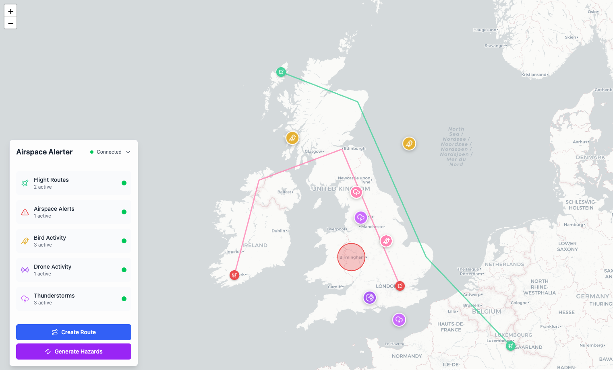

# AppSync Events in Event Driven Architecture (EDA) Demo Project

A sample CDK Typescript Project that demonstrates the use of AWS services for real-time feedback to users using Appsync Events.



[](https://opensource.org/licenses/Apache-2.0)

## 📋 Table of Contents

## 🎯 Overview

This project demonstrates a serverless application built with AWS CDK (in Typescript)
## 🏗 Architecture

The platform consists of two main components:

- **Frontend**: React-based web application served via CloudFront. Deployed with AWS CDK.
- **Backend**: Serverless API built with AWS Lambda and API Gateway, using DynamoDB for data storage and event driven architecture for real-time updates. Deployed with AWS CDK.

AWS services consist of:
- AWS Lambda for serverless compute
- Amazon DynamoDB for data storage and event-driven architecture
- Amazon S3 for static hosting
- Amazon CloudFront for content delivery

## 🔧 System Prerequisites

Before you begin, ensure you have the following prerequisites installed and configured on your local machine:
- Node.js
- npm (latest stable version)
- AWS CLI configured with appropriate credentials, connected to a valid AWS account
- AWS CDK CLI (`npm install -g aws-cdk`)
- A bootstrapped AWS environment in the desired region (e.g., `eu-west-1`): `cdk bootstrap --region eu-west-1`
- AWS SAM CLI (for local development)

## 🚀 Getting Started

1. **Install dependencies**
   ```bash
   npm install
   ```

2. **Deploy the application (Frontend and Backend)**
   ```bash
   npm run deploy
   ```

> Note: running npm run deploy will deploy the backend and the frontend of the application. These are technically two different CDK applications. More details of the deployment process can be found in the [Deployment](#-deployment) section.

Following deployment, the frontend application will be available at the CloudFront URL outputted in the terminal. The backend API will also be available, and the frontend will automatically connect to it.

## 📁 Project Structure

```bash
.
├── bin/                   # CDK app entry points (backend and frontend)
├── config/                # Environment configurations
├── frontend/              # React frontend application. Used to demonstrate the backend API
├── lib/                   # CDK infrastructure code
│   ├── constructs/        # Reusable CDK constructs
│   ├── stateful/          # Stateful resource stacks (DynamoDB)
│   └── stateless/         # Stateless resource stacks (Lambda, API Gateway) - Uses nested stacks
│   └── frontend/          # Frontend resource stacks (S3 and CloudFront)
├── src/                   # Lambda function source code
└── test/                  # Test files and test payloads for locally invoking Lambda functions
```

## 💻 Frontend Application

The frontend application is built using React and Tailwind CSS, providing a interactive user interface for visualizing points of interest. This has been built for the purposes of demonstrating the system backend and is not intended for production use. It has the following features:

- **Interactive Map**: Built with React Leaflet for smooth map interactions
- 

The app will connect to the deployed backend API using configuration from `src/cdk-output.json`.

To run locally:
```bash
cd frontend
npm install
npm start
```

The frontend running locally will connect to the deployed backend API, which is configured with an output of the backend CDK deployment and written to the `frontend/src/cdk-output.json` file.

## 🛠 Backend Application

### Local Development and Debugging

It is possible to run and debug the backend Lambda functions locally using the AWS SAM CLI. This allows you to test Lambda functions and API Gateway endpoints without deploying to AWS.

For VSCode users, the launch configurations are provided in `.vscode/launch.json`. This allows you to run and debug Lambda functions locally with breakpoints and logging.

1. Install AWS SAM CLI
2. Ensure the backend is deployed at least once to create the necessary resources (see [Deployment](#-deployment) section)
3. Modify the `local.env.json` file in the root of the project. This file should contain the environment variables required for local development, such as API keys and DynamoDB table names.
4. Use VSCode debugging configurations in `.vscode/launch.json`
5. Run Lambda functions locally for testing

## 🚢 Deployment

The project uses CDK project (in Typescript) for infrastructure definition and deployment.

The deployment is split into two CDK projects:
- **Backend**: Contains the stateless and stateful stacks. The command `npm run deploy:backend` will deploy the backend CDK stacks. Following completion of the backend deployment, it will output the necessary API Gateway endpoint URLs to the `cdk-output.json` file in the `frontend/src` directory. This file is used by the frontend application to connect to the backend API.
- **Frontend**: Contains the static hosting stack. The command `npm run deploy:frontend` will build the frontend React application and deploy the frontend application to an S3 bucket and configure CloudFront for content delivery.

To deploy the entire application, you can run `npm run deploy` which will run both the backend and frontend deployments sequentially.

## 🌐 Backend REST API

Following deployment, the backend API will available at:
```bash
https://[api-id].execute-api.[region].amazonaws.com/prod/
```

It is secured with an API key, which is generated during the deployment process. The API key is required for all requests to the backend.

Key endpoints:


## 💰 Costs

The application is full serverless and uses various AWS serverless services, which may incur costs based on usage. There are no fixed costs for the application, but you should be aware of the following potential costs:
- AWS Lambda: Charged based on the number of requests and execution time
- Amazon DynamoDB: Charged based on read/write capacity and storage
- Amazon S3: Charged based on storage and data transfer

## 🗑️ Cleanup

To clean up the deployed resources, run:
```bash
npm run destroy
```

## 📄 License

This project is licensed under the [Apache License 2.0](https://www.apache.org/licenses/LICENSE-2.0). See the [LICENSE](LICENSE) file for details.